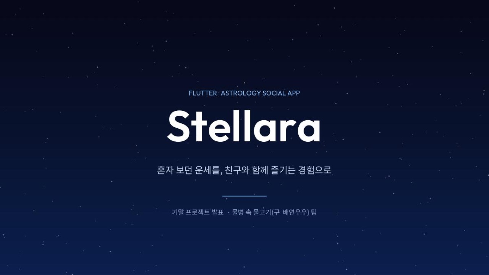
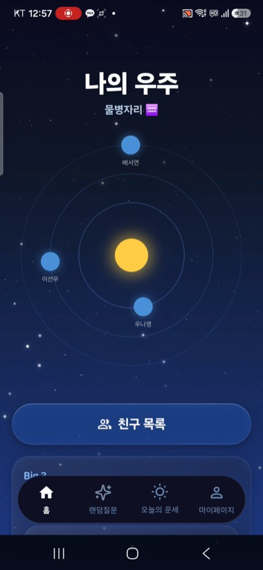
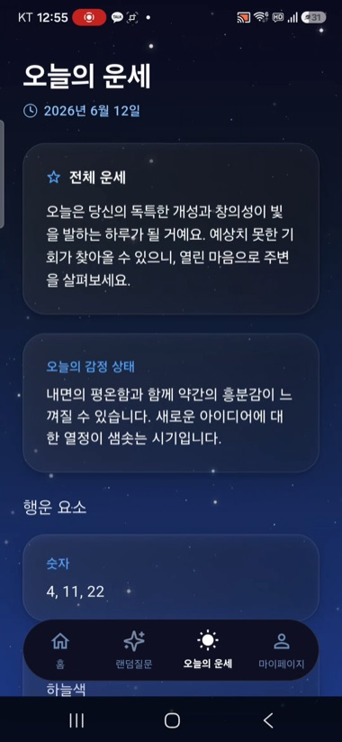
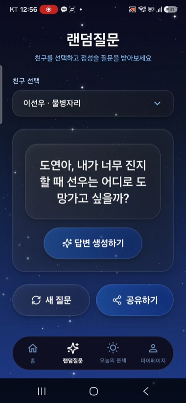
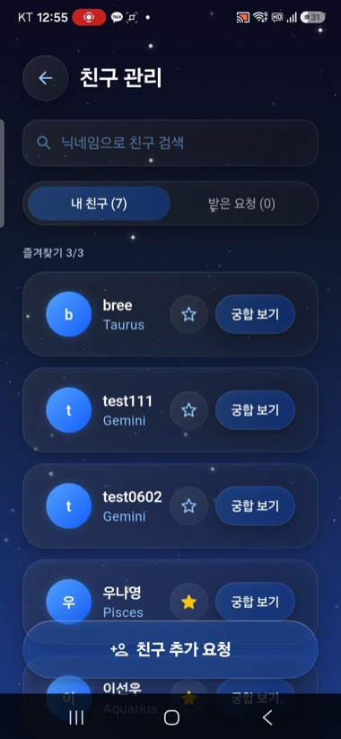
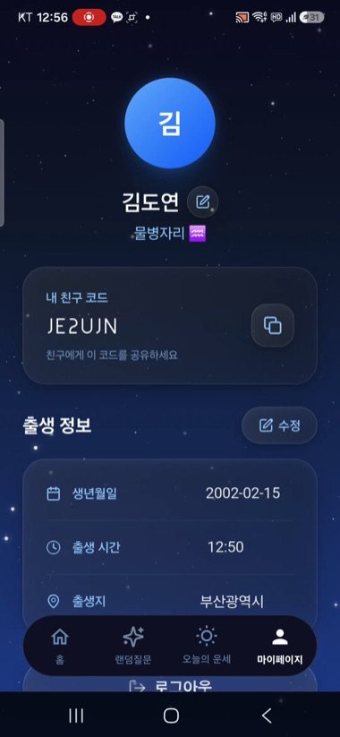
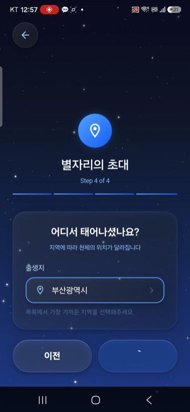

<div align="center">



**출생 정보(생년월일·시간·장소)를 기반으로 별자리와 궁합을 읽어주는 점성술 모바일 앱**

네이탈 차트를 계산해 나의 별을 시각화하고, 친구와의 **궁합(synastry)** 을 확인하며,<br/>
매일의 운세와 별자리 기반 랜덤 질문을 즐길 수 있습니다.

<br/>


</div>

---

## 📱 화면 미리보기

<div align="center">
<table>
  <tr>
    <td align="center" width="33%"><br/><sub><b>홈 · 나의 우주</b><br/>내 별·친구 행성 시각화</sub></td>
    <td align="center" width="33%"><br/><sub><b>오늘의 운세</b><br/>운세·감정·행운 요소</sub></td>
    <td align="center" width="33%"><br/><sub><b>랜덤 질문</b><br/>별자리 기반 AI 질문</sub></td>
  </tr>
  <tr>
    <td align="center" width="33%"><br/><sub><b>친구 · 궁합</b><br/>친구 관리 & 궁합 보기</sub></td>
    <td align="center" width="33%"><br/><sub><b>마이페이지</b><br/>친구 코드·출생 정보</sub></td>
    <td align="center" width="33%"><br/><sub><b>온보딩</b><br/>출생 정보 4단계 입력</sub></td>
  </tr>
</table>
</div>

---

## 🎬 시연 영상 · 발표 자료

<div align="center">

<video src="https://github.com/bellca225/stellara/raw/main/docs/stellara_demo.mp4" controls muted width="320"></video>

</div>

> 영상 플레이어가 보이지 않으면 아래 링크로 확인하세요.

| | 자료 | 링크 |
|:-:|---|---|
| ▶️ | **시연 영상** — 앱 전체 흐름 데모 (약 3분 30초) | **[docs/stellara_demo.mp4 다운로드](docs/stellara_demo.mp4)** |
| 📑 | **발표 자료** — 프로젝트 발표 최종본 (13p) | **[docs/stellara_presentation.pdf 보기](docs/stellara_presentation.pdf)** |

---

## 📖 앱 개요

| 항목 | 내용 |
|---|---|
| **앱 이름** | Stellara |
| **한 줄 소개** | 출생 정보를 기반으로 점성술 해석을 시각적 UI로 제공하는 모바일 서비스 |
| **플랫폼 / 언어** | Flutter / Dart |
| **팀명** | 물병 안 물고기 |
| **팀원** | 우나영 · 김도연 · 배서연 · 이선우 (4인) |

---

## 🌟 주요 기능

<table>
<tr>
<td width="50%" valign="top">

### 🔐 회원가입 / 로그인
아이디·비밀번호로 가입 (내부적으로 가상 이메일 변환).
Firebase Authentication으로 세션 관리, 가입 시 트랜잭션으로 친구 코드 자동 발급.

### 🪐 출생 차트 / 점성술
생년월일·출생시간·출생지로 네이탈 차트를 계산해
행성·별자리·하우스를 시각화하고 상세 해석을 제공.

### 💞 궁합 분석 (Synastry)
두 사람의 차트를 로컬 `CompatibilityEngine`이 결정론적으로 비교해
**감정·대화·연애·우정 4축 점수(%)** 와 해설을 계산.

</td>
<td width="50%" valign="top">

### 👥 친구 관리
친구 코드로 추가·검색, 요청 수락/거절,
즐겨찾기(서버에서 3명 제한 강제) 관리.

### 🔮 오늘의 운세 / 랜덤 질문
매일의 운세·감정 상태·행운 요소(숫자·색상·장소) 추천,
별자리 기반 AI 랜덤 질문 생성.

### 📤 SNS 공유
운세·궁합·랜덤 질문 결과를 카드 이미지(PNG)로 캡처해
웹 다운로드 / 모바일 공유 시트로 공유.

</td>
</tr>
</table>

---

## 🛠️ 기술 스택

| 영역 | 사용 기술 |
|---|---|
| **프레임워크 / 언어** | Flutter · Dart (`sdk ^3.11.1`) |
| **상태 관리** | Riverpod (`flutter_riverpod ^2.5.1`) — 수동 Provider 선언 방식 |
| **인증** | Firebase Authentication (`firebase_auth ^6.5.1`) — Email/Password |
| **데이터베이스** | Cloud Firestore (`cloud_firestore ^6.4.1`) — 실시간 동기화 + 오프라인 캐시 |
| **데이터 모델** | freezed · json_serializable (불변 모델 · JSON 직렬화) |
| **네트워크** | dio · http |
| **점성술 API** | Prokerala Astrology API — 행성·하우스·어스펙트 등 네이탈 차트 계산 |
| **AI 콘텐츠** | Google Gemini (1순위) → OpenAI → Anthropic 순 fallback |
| **로컬 저장** | shared_preferences (당일 운세 캐시) · 디스크 캐시(L2, `chartVersion` 키) |
| **UI / 기타** | flutter_svg · google_fonts · share_plus · intl · flutter_dotenv |

---

## 🗺️ 화면 구성

```
LANDING ──┬─ SIGNUP ─→ ONBOARDING(출생정보 4단계) ─┐
          └─ LOGIN ───────────────────────────────┴─→ HOME (MAIN)
                                                         │
   ┌─────────────────────┬──────────────────┬───────────┴──────────┐
   ▼                     ▼                  ▼                      ▼
ASTROLOGY(상세 분석)   FRIEND(친구 관리)   TODAY(오늘의 운세)   MYPAGE(정보 수정)
                         │
                    ┌────┴─────┐
                    ▼          ▼
              ADDFRIEND    MATCH(궁합 결과) ─→ SHARE(공유 카드)
                                              ▲
                                     CONTENT(랜덤 질문) ┘
```

하단 네비게이션: **홈 · 랜덤 질문 · 오늘의 운세 · 마이페이지**

---

## 🏗️ 프로젝트 구조

```
lib/
├─ core/            공통 테마·위젯·유틸·환경설정·HTTP·캐시·Firebase
└─ features/        기능별 모듈
   ├─ astrology/      출생 차트 / 점성술
   ├─ auth/           로그인 / 회원가입
   ├─ compatibility/  궁합 (CompatibilityEngine)
   ├─ content/        랜덤 질문 등 콘텐츠
   ├─ friends/        친구 관리
   ├─ home/           홈 화면
   ├─ horoscope/      오늘의 운세
   ├─ onboarding/     온보딩(출생 정보 입력)
   ├─ profile/        마이페이지
   ├─ share/          공유 카드
   └─ users/          사용자 데이터
```

각 기능 모듈은 **`presentation`**(화면·위젯) · **`application`**(상태·로직) · **`data`**(저장소) · **`domain`**(모델) 계층으로 나뉩니다.

---

## 🚀 시작하기

### 1. 요구 환경
- Flutter SDK (Dart `^3.11.1` 이상, 최신 stable 권장)
- Android 에뮬레이터·기기 또는 Chrome(웹)

### 2. 의존성 설치
```bash
flutter pub get
```

### 3. 환경 변수 파일(`.env`) 생성 — **필수**
`.env`를 에셋으로 사용합니다. 실제 키는 저장소에 포함하지 않으므로 예시 파일을 복사하세요.
```bash
cp .env.example .env
```
> 기본값은 외부 유료 API를 호출하지 않고 **내장 샘플 데이터로 동작**하므로, **키를 비워둔 채로도 앱이 정상 실행**됩니다.
> 실제 점성술/AI 기능을 켜려면 아래 키를 채운 뒤 `.env`의 `PROKERALA_REMOTE_ENABLED` / `AI_REMOTE_ENABLED`를 `true`로 변경하세요.

| 키 | 발급처 |
|---|---|
| `PROKERALA_CLIENT_ID` / `..._SECRET` | https://api.prokerala.com |
| `GEMINI_API_KEY` | https://aistudio.google.com/app/apikey |
| `OPENAI_API_KEY` | https://platform.openai.com/api-keys |
| `ANTHROPIC_API_KEY` | https://console.anthropic.com/settings/keys |

### 4. 실행
```bash
flutter run              # 연결된 기기/에뮬레이터
flutter run -d chrome    # 웹(Chrome)
```

---

## 👩‍💻 팀 구성

| 이름 | 역할 | 담당 |
|---|---|---|
| **우나영** | 팀장 · UI/기능 개발 | Firebase 인증·온보딩·멤버 관리, 점성술 분석·궁합·랜덤 질문 로직, 최종 CSS 정리 |
| **김도연** | UI/기능 개발 | 전체 화면 기획, 홈 화면 애니메이션, 전체 페이지 디자인 반영 |
| **배서연** | UI 개발 · 기능 기획 | 전체 화면 기획, 로직 정리, 디자인 컨셉 기획, UI 디자인 |
| **이선우** | UI 개발 · 기능 기획 | 전체 화면 기획, 로직 정리, 디자인 컨셉 기획, UI 디자인 |

---

## 📚 참고 자료
- [Prokerala Astrology API](https://api.prokerala.com/docs)
- [Firebase for Flutter](https://firebase.flutter.dev)
- [Flutter Riverpod](https://riverpod.dev)

---

<div align="center">

학습/포트폴리오 목적으로 제작된 프로젝트입니다. ✨

</div>
